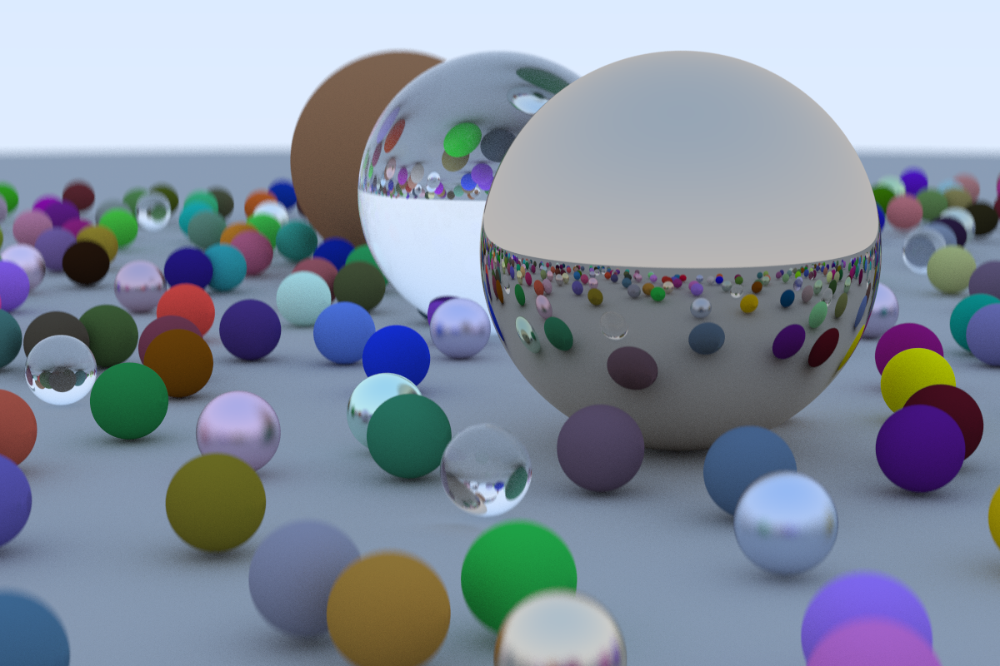

# Ray tracing in Rust

I'm currently learning Rust, so I thought... why not implement a ray tracer,
right? So here we are!

This is, as the title already explains, a ray tracer written in Rust in my spare
time. This work is based on [_Ray Tracing in One
Weekend_](https://raytracing.github.io/books/RayTracingInOneWeekend.html). It's
still pretty _slow_, for instance, the following picture needs about 7 minutes
for completion --- which I think is _a lot_.

## The end result (for now...)



## Example usage

There are currently two different scenes that you can execute, the `easy` and
the `random`, the later shown in the previous section. An usage example:
```
$ cargo run --release name_of_the_file random
```
The program will then write the _ppm format_ image to the requested file and to
open the file `output/name_of_the_file.ppm` using [feh](https://wiki.archlinux.org/title/Feh).

## TODO

* PNG converter
* User specified scene and parameters in JSON format
* Lightings
* Textures
* Different shapes
* More to come... (maybe, though)
