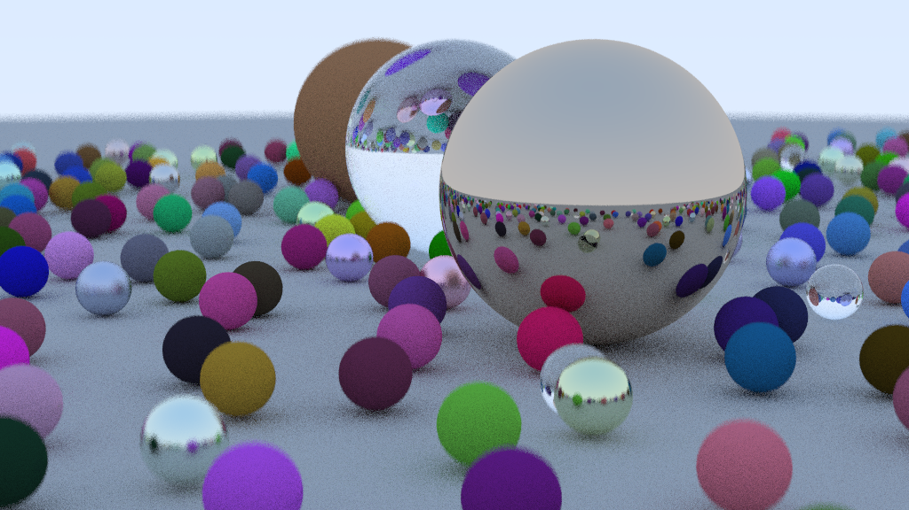

# DISCLAIMER

> This project is now hosted at https://git.sr.ht/~presheaf/radiant
>
> This repository will no longer be updated. Please refer to the new hosting
> page for new development and contributions or contact me via e-mail.

# A simple ray tracer

This is my first time attempting a ray tracing renderer! This work is based on [_Ray Tracing in One
Weekend_](https://raytracing.github.io/books/RayTracingInOneWeekend.html).

## Example usage

You can simply run

```
cargo run -- --help
```

and the program will output information on how to use it. You can tweak the output directory, output
file name, and scene type (from the only two available default scenes `basic` and `complex`). The
program will output a png file at the requested location, and will try to open it using
[feh](https://wiki.archlinux.org/title/Feh) for visualization.

## Results

The configuration for the maximal number of ray bounces, the number of antialiasing samples, and the
image dimensions can be found at `src/camera.rs`. For the following examples, I use an image
resolution of 1024 by 576.

Using 20 antialiasing samples and a maximum of 8 bounces, we can render (in release mode) in less
than a second the following basic scene:

```
cargo run --release -- --scene=basic
```


For a more interesting scene we can get the following result in about 20 seconds:

```
cargo run --release -- --scene=complex
```



If you have the time and patience, however, you can render a big boy like the following in about 7
minutes (with dimensions 1200 by 800, 500 antialiasing samples, and 50 bounces):


